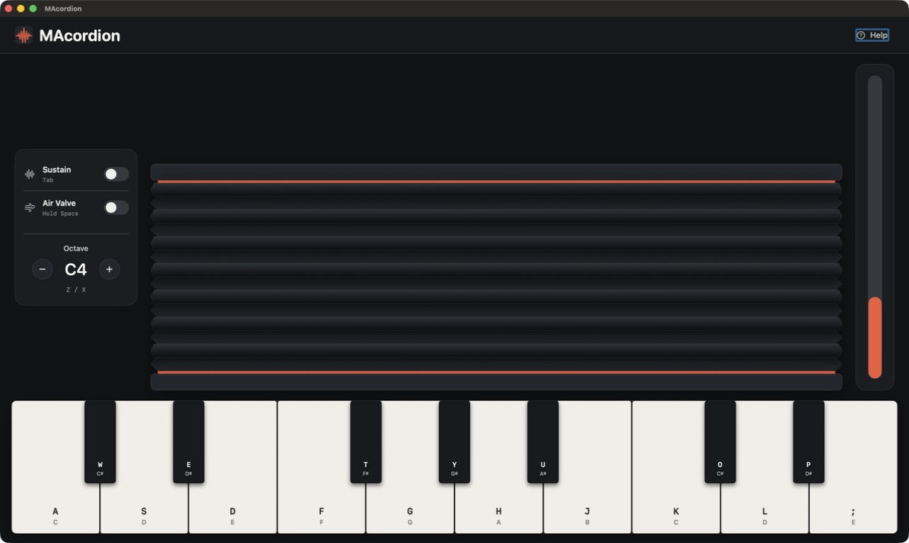
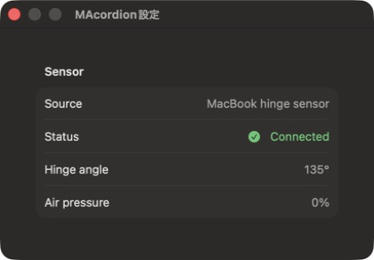

# MAcordion 🪗
*Vibe coded by bruiselea*

MAcordion turns your MacBook itself into a playable instrument. Open and close
the display to move the on-screen bellows, then use the Mac keyboard to play
notes. The hinge speed controls the airflow and expression, so the physical
movement of the computer becomes part of the performance.

MAcordionは、MacBookそのものを楽器にするmacOSアプリです。ディスプレイの
開閉と画面上の蛇腹が同期し、ヒンジを動かす速さで空気の流れと音の表情を
コントロールできます。Macのキーボードで音階を演奏します。



## What MAcordion includes

- **Physical bellows control** — the vertical bellows follows the measured
  MacBook display angle directly, without visual spring lag.
- **Playable Mac keyboard** — notes remain responsive while the hinge is moving.
- **Native sensor access** — the hinge edition uses macOS IOHID directly, with
  no Python, pybooklid, or Homebrew dependency.
- **Focused performance UI** — the main window keeps only the instrument,
  essential controls, keyboard, and an unobtrusive air-expression meter.
- **Separate diagnostics** — connection state, hinge angle, and air pressure
  live in the native **MAcordion → Settings…** window.
- **English and Japanese** — interface copy, onboarding, accessibility labels,
  Settings, and permission descriptions follow the Mac's preferred language.
- **Three input editions** — Hinge, Breath, and Shisha variants share the same
  instrument and keyboard mapping.
- **Reproducible Universal 2 packages** — release ZIPs support Apple Silicon
  and Intel Macs.

<details>
<summary>Sensor diagnostics</summary>

Open **MAcordion → Settings…** to inspect the live sensor state without adding
diagnostic clutter to the performance view.



</details>

## Safety notice

> **USE AT YOUR OWN RISK:** This application reads MacBook hardware sensors
> (lid angle / hinge) and can access the microphone in Breath mode. Move the
> display gently and never force the hinge beyond its normal range. The
> developers assume no liability for device damage or data loss.

## Launch Options

Three separate apps share the same audio engine and key mapping:

- **MAcordion** — bellows driven by the MacBook lid angle sensor (classic accordion).
- **MAcordionBreath** — bellows driven by microphone amplitude (melodica style).
- **MAcordionShisha** — bellows driven by the USB-C-to-Shisha differential-pressure sensor (ESP32-C3 firmware).

With Swift Package Manager:

```bash
swift run MAcordion        # Hinge sensor version
swift run MAcordionBreath  # Breath (microphone) version
swift run MAcordionShisha  # Shisha sensor version
```

If the bellows source is unavailable (no hinge sensor, no mic permission, no shisha device plugged in), the app falls back to a keyboard-only mode with fixed expression.

### Shisha sensor setup
Flash `firmware/esp32c3/shisha_sensor/shisha_sensor.ino` onto an ESP32-C3 Supermini wired to an MPXV7002DP via a 10k/27k divider, plug it in via USB-C, then `swift run MAcordionShisha`. The app auto-detects `/dev/cu.usbmodem*`. Override with `SHISHA_PORT=/dev/cu.usbmodemXXXX swift run MAcordionShisha` if multiple devices are connected.

## Controls

| Key | Function |
|-----|----------|
| `A S D F G H J K L ;` | White keys (C D E F G A B C D E) |
| `W E T Y U O P` | Black keys (C# D# F# G# A# C# D#) |
| `Spacebar` | Air Valve — pump the bellows without sound |
| `Tab` | Toggle Sustain on/off |
| `Z` | Octave Down |
| `X` | Octave Up |

> Make sure the MAcordion window has focus before playing.

## Requirements

- macOS 13.0+
- Swift 5.9+ / Xcode 15+
- Hinge version: a supported MacBook lid-angle sensor
- Breath version: microphone access (macOS will prompt on first launch)

## Reproducible release packages

Create signed application bundles and deterministic ZIP archives with:

```bash
./scripts/package.sh
```

The command builds Universal 2 binaries for Apple Silicon and Intel, then
writes all three release variants to `dist/`:

- `MAcordion-<version>-<architecture>.zip`
- `MAcordionBreath-<version>-<architecture>.zip`
- `MAcordionShisha-<version>-<architecture>.zip`
- `SHA256SUMS` and `BUILD-INFO.txt`

The default signature is ad hoc, so these local packages are not notarized.
On another Mac, Control-click the app and choose **Open** on first launch.
For normal Gatekeeper-approved distribution, set `SIGN_IDENTITY` to a
Developer ID Application certificate and notarize the resulting archive.
Version and build metadata can also be overridden:

```bash
APP_VERSION=1.4.0 BUILD_NUMBER=1 \
SIGN_IDENTITY="Developer ID Application: Example (TEAMID)" \
./scripts/package.sh
```

For byte-for-byte ZIP reproduction, use the same source revision, Xcode/Swift
toolchain, macOS SDK, CPU architecture, signing identity, and
`SOURCE_DATE_EPOCH`. The exact build environment is recorded in
`dist/BUILD-INFO.txt`.

To build only one architecture, set `ARCHITECTURES`, for example:

```bash
ARCHITECTURES=arm64 ./scripts/package.sh
```
